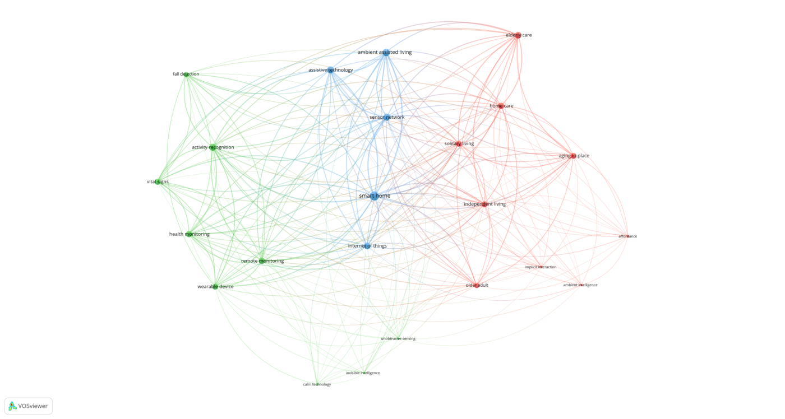
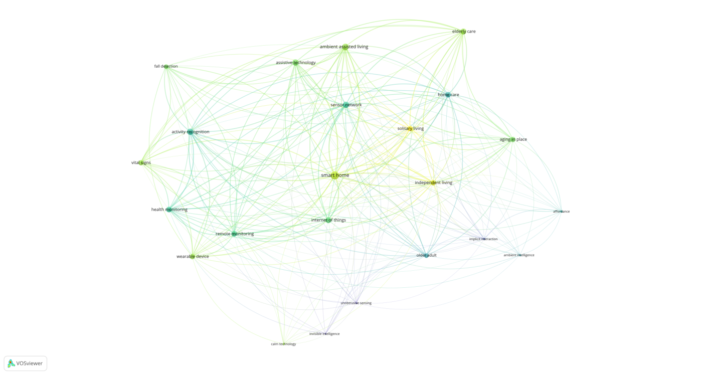

# VOSviewer Bibliometric

**把 VOSviewer 的关键词共现分析全自动化——一条命令，从文献导出文件到可发表的网络图与分析报告。**

[](https://www.python.org/)
[](LICENSE)
[](#依赖)

---

## 解决什么问题

VOSviewer 是文献计量领域最常用的可视化工具，但它有个硬伤：**没有命令行批量处理能力，也没有无头模式**。做一次关键词共现分析，你得手动完成：

1. 从数据库导出文献 → 2. 手工整理成 VOSviewer 格式 → 3. 导入界面 → 4. 人工核对同义词并逐一合并 → 5. 调阈值反复试 → 6. 截图 → 7. 另外算模块度、中介中心性等论文要用的指标

**本工具把这一整套流程压缩成一条命令。**

```bash
python scripts/run_pipeline.py --input savedrecs.txt --outdir outputs --min-occurrences 5
```

产出：网络图 / 年份叠加图 / 密度图（PNG + SVG 矢量）+ 分析报告 + 可编辑的同义词表。

---

## 示例产出

下面两张图是用 `examples/sample_wos.txt`（150 篇合成数据）跑出来的实际结果，
命令就是 README 里那条，没有手工干预：

**网络视图** — 节点大小=关键词频次，颜色=聚类，连线粗细=共现强度



**年份叠加视图** — 颜色代表平均发表年（蓝→绿→黄），用于观察研究热点的演进



> 图中数据为**合成数据**，仅用于演示，不具备学术意义。

---

## 为什么值得用

### 1. 真的自动化了 VOSviewer

VOSviewer 官方手册 5.1 节列了 60+ 个命令行参数，但没人在工程上把它串起来。本工具用「启动 → 轮询等图片生成 → 关闭进程」的方式驱动 GUI 程序完成全自动出图。

**顺带做了性能优化**：实测「算布局聚类」与「导出图片」可以在同一次启动内完成，且一次启动能导出多种格式（PNG+SVG+PDF）。因此窗口弹出次数 = 视图数，而不是「视图数 × 格式数」——**3 视图 + SVG 从 7 次启动降到 3 次**。

### 2. 内建方法学严谨性（这是真正的差异点）

大多数文献计量脚本只做「统计 → 出图」。本工具把**真实数据踩过的坑**做成了内建检查：

| 检查 | 为什么需要 |
|---|---|
| **零共现的显著性检验** | 「实际共现 0 次」看着像研究空白，但小样本下完全可能是偶然。工具用超几何检验给出 p 值，只把显著的列为可用证据 |
| **检索污染检测** | 宽泛的检索式会捞进大量不相关文献。实测某份数据 38% 是污染（研究养老却混进《佛山陶瓷》） |
| **枢纽词识别** | 检索词本身常出现在半数以上文献中，会形成星形枢纽把结构压平。工具会提示并用 `--exclude-terms` 处理 |
| **中文同义词归并** | 中文靠加修饰词造新词（「老年」⊂「老年群体」），相似度法会漏掉。工具用**共现率**消歧：真同义词互斥出现，相关概念经常共现 |

### 3. 中文文献支持是完整的

多数同类工具只支持 WoS / Scopus。本工具对 CNKI 做了完整适配，包括一个**实测踩出来的坑**：CNKI 的 RefWorks 导出**不使用 `ER` 记录结束标记**，记录靠「空行 + 新 `RT`」分隔。不了解这点会把几百条记录解析成一条。

### 4. 依赖极轻

**核心功能零第三方依赖**（纯标准库）。只有两个可选依赖，且都是懒加载 + 优雅降级：

| 依赖 | 用途 | 缺失时 |
|---|---|---|
| `networkx` | Louvain 聚类、中介中心性 | 降级为连通分量聚类 |
| `pandas` | 仅 Excel 解析 | 其他格式不受影响 |

```bash
pip install networkx    # 推荐，解锁完整功能
```

---

## 快速开始

### 1. 准备环境

```bash
git clone https://github.com/xjl344/vosviewer-bibliometric.git
cd vosviewer-bibliometric

# 自动下载 Java 与 VOSviewer（约 115MB）
python scripts/setup_runtime.py --install

# 检查环境
python scripts/setup_runtime.py --check
```

脚本会**按你的系统与 CPU 架构自动选包**，无需手动指定：

| 平台 | 架构 | 自动选择 |
|---|---|---|
| Windows | x64 | Azul Zulu JRE 21 (win_x64) |
| Linux | x64 | Azul Zulu JRE 21 (linux_x64) |
| Linux | ARM64 | Azul Zulu JRE 21 (linux_aarch64) |
| macOS | Intel | Azul Zulu JRE 21 (macosx_x64) |
| macOS | Apple Silicon | Azul Zulu JRE 21 (macosx_aarch64) |

> **国内网络**加 `--mirror` 走清华 Adoptium 镜像（更快，失败自动回退 Azul CDN）。
>
> **已有 Java 8+** 的话可以跳过这步，工具会自动在系统里找。

运行时默认装到 `~/.vosviewer-bibliometric/runtime/`。
想换位置就设环境变量：

```bash
export VOSVIEWER_RUNTIME=/your/custom/path    # Linux / macOS
set VOSVIEWER_RUNTIME=D:\your\custom\path     # Windows
```

### 2. 导出文献

| 数据库 | 导出方式 |
|---|---|
| **Web of Science** | 选「核心合集」→ 导出「制表符分隔文件」→ 记录内容选「**全记录与引用的参考文献**」 |
| **CNKI** | 导出与分析 → **RefWorks** 或 **EndNote** 格式 |
| **Scopus** | 导出 CSV，需含 Author Keywords 列 |
| **PubMed** | 无需导出，用 `scripts/fetch_pubmed.py` 直接抓 |

> ⚠️ 常见错误：WoS 导出成「仅题录」会导致没有关键词。工具会检测并提示。

### 3. 先跑解析（2 秒）

```bash
python scripts/run_pipeline.py \
    --input savedrecs.txt \
    --outdir outputs \
    --stage analyze
```

这一步不启动 VOSviewer，秒级完成，产出**同义词复核清单**。打开看一眼，把该合并的词写进 `outputs/vosviewer_input/thesaurus.txt`。

### 4. 再出图（约 3 分钟）

```bash
python scripts/run_pipeline.py \
    --input savedrecs.txt \
    --outdir outputs \
    --min-occurrences 5 \
    --views network overlay density \
    --vector \
    --stage render
```

---

## 产出说明

```
outputs/
├── figures/
│   ├── vosviewer_network.png     网络视图：主题聚类结构
│   ├── vosviewer_overlay.png     叠加视图：颜色=平均发表年，看趋势
│   ├── vosviewer_density.png     密度视图：核心区与边缘区
│   └── vosviewer_*.svg           矢量版，排版放大不失真
├── 分析报告.md                    含可改写进论文的方法学段落
├── 同义词归并复核清单.md           待人工确认的归并候选
├── 指标.json                     机器可读的全部指标
└── vosviewer_input/              中间文件（可拖进 VOSviewer 手工微调）
```

图片默认约 3200×1700 像素，满足期刊出版要求。

---

## 常用参数

| 参数 | 默认 | 说明 |
|---|---|---|
| `--input` | 必填 | 可多个文件，格式自动识别 |
| `--min-occurrences` | 5 | 关键词入选阈值。图太乱调高，节点太少调低 |
| `--exclude-terms` | 无 | **剔除枢纽词**（通常填检索词本身） |
| `--filter-terms` | 无 | **领域白名单**，剔除检索污染 |
| `--resolution` | 1.0 | 聚类分辨率。小网络（<40 节点）用 0.6–0.8，大网络用 1.2–1.5 |
| `--drop-generic` | 关 | 剔除通用学科词（用 Keywords Plus 时建议开） |
| `--largest-component` | 关 | 只保留最大连通分量 |
| `--stage` | full | `analyze`=只出清单（秒级）/ `render`=只出图 |
| `--preset` | 无 | 领域预设同义词表 |

完整参数见 `python scripts/run_pipeline.py --help`。

---

## 支持的文件格式

已全部实测通过：

| 格式 | 说明 |
|---|---|
| WoS 制表符分隔 | `savedrecs.txt`，最常用 |
| WoS 纯文本全记录 | 含 Keywords Plus（`ID` 字段） |
| CNKI RefWorks | `K1` 字段，**无需 `ER` 标记** |
| CNKI EndNote | `%K` 字段 |
| Scopus CSV | 需含 ≥2 个 Scopus 特有列 |
| PubMed XML / CSV | 由 `fetch_pubmed.py` 产出 |
| RIS | `TY` / `KW` 标签 |
| BibTeX | `keywords` 逗号分隔、`author` 用 `and` |
| 通用 CSV / TSV | 自动识别中英文关键词列 |
| Excel (.xlsx/.xls) | 中英文表头均可 |

---

## 已知限制

诚实说明，避免误用：

**关于 VOSviewer 窗口**
- VOSviewer 无无头模式，出图时**窗口会一闪而过**，这是正常现象
- 流程结束会打印实际启动次数（已优化到最少）

**关于数据源**
- **OpenAlex 的 `keywords` 字段不适合本分析**——它是算法抽取的概念，会混入 `Computer science`、`Work (physics)` 这类学科标签和概念片段。实测跑出的聚类中有纯垃圾簇
- WoS 的 Keywords Plus、Scopus 的 Index Keywords 也是算法生成，可用但需在方法里说明

**关于指标解读**
- **模块度 Q 低不等于分析失败**。高度交叉的领域（如「智慧养老」）Q 天然偏低（0.05–0.15），但聚类主题可能很清晰。关键看「Q 低时聚类成员是否同质」
- **合并同义词会让 Q 下降，但这是正确的**——重复概念作为独立节点会人为撑高 Q
- **「0 篇命中」不等于「无相关研究」**。不同研究者对同一研究可能用完全不同的关键词。实测某次检索三者交叉为 0 篇，但人工核查邻近领域发现了一篇 2026 年高度相关的论文

**关于样本量**
- 文献量 < 100 篇时聚类稳定性有限，工具会主动提示
- 建议 200–500 篇

---

## 设计取舍

**为什么不用 Python 重写 VOSviewer 的布局算法？**
VOSviewer 的布局与聚类是学术界的参考实现，用它算出的结果可被审稿人接受、可复现。本工具只在 VOSviewer 不可用时降级到本地算法（Louvain + 力导向布局）。

**为什么同义词归并要人工确认？**
同义词判断依赖领域知识。工具负责「把候选找出来并按可能性排序」（用共现率消歧），最终决定权留给研究者——因为这个词表是要写进论文方法学部分的。

**为什么把检索词从网络中剔除是默认建议？**
检索词常出现在半数以上文献中，会形成星形枢纽掩盖真实结构。这是文献计量的规范做法，论文中如实说明即可。

---

## 开发说明

本工具的开发过程中，**9 个 bug 全部由真实数据暴露，合成数据一个都没测出来**。这包括：

- CNKI RefWorks 不带 `ER` 标记导致 120 条记录被解析成 1 条
- 自动归并与人工规则形成循环映射，导致两个词形同时残留
- 括号清洗顺序错误，反而制造出括号异常
- VOSviewer 使用 `-largest_component` 后只回写部分节点，导致图表与报告不一致

这塑造了本项目的一个原则：**测试必须用真实数据，合成数据只能验证「跑得通」，验证不了「对不对」。**

---

## 引用

如果本工具对你的研究有帮助：

```bibtex
@software{vosviewer_bibliometric,
  title  = {VOSviewer Bibliometric: Automated keyword co-occurrence analysis},
  author = {Xie, Junlei},
  year   = {2026},
  url    = {https://github.com/xjl344/vosviewer-bibliometric}
}
```

## 授权

MIT License。详见 [LICENSE](LICENSE)。

**本仓库不打包 VOSviewer 本体与 Java 运行时**——它们由 `setup_runtime.py` 在用户本地按需下载。也不再分发 VOSviewer 的官方示例数据文件。

VOSviewer 由 CWTS（莱顿大学）的 Nees Jan van Eck 与 Ludo Waltman 开发，官网声明「can be used freely for any purpose」。

## 致谢

- [VOSviewer](https://www.vosviewer.com/) — 布局与聚类算法
- [Azul Zulu](https://cdn.azul.com/) — 免安装 Java 运行时
- [PubMed E-utilities](https://www.ncbi.nlm.nih.gov/books/NBK25501/) / [OpenAlex](https://openalex.org/) — 文献数据抓取
